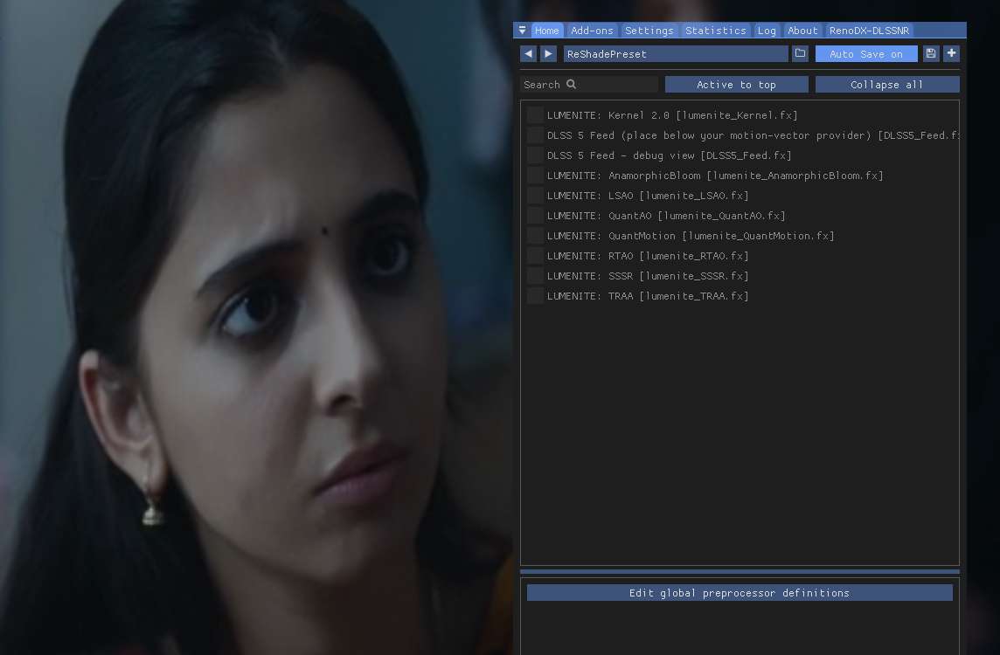
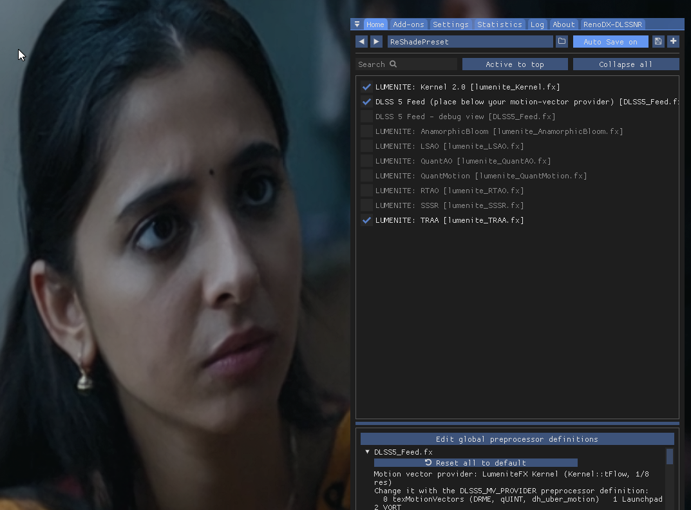
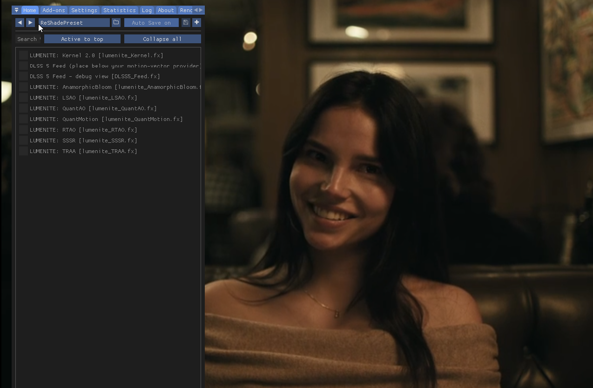
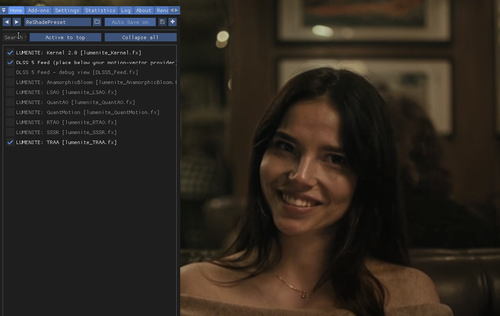

# DLSS5 VLC Upscaler

ReShade + DLSS5-Feeder + RenoDX DLSS 5 add-on injected into VLC — or any Windows `.exe` — at runtime. Runs the DLSS 5 Neural Rendering pass inside the target process via the community NGX caller, alongside Lumenite motion-vector synthesis and mask-guided detail enhancement.

**By [@Ishanoshada](https://github.com/Ishanoshada)**


## Before / After

Real screenshots from a 640×360 HDRip upscaled through the stack on an RTX 3050 Laptop. Played in VLC with the DLSS5-Feeder pipeline active. Left = ReShade off, right = Lumenite_Kernel + DLSS5_Feed enabled. 

| ReShade off | DLSS5 active |
|---|---|
|  |  |


**What changes:**

- Sharper edges on faces, hair, text overlays
- Cleaner gradients in dark scenes (Lumenite temporal stabilization kills compression banding)
- Fine grain preserved, noise not amplified (DLSS5_Feed detail mask at threshold 0.015)
- Highlights slightly cleaner (lighting mask at 0.070)

### Comparison 2

| ReShade off | DLSS5 active |
|---|---|
|  |  |


## What this actually does

| Component | Runs in target? |
|---|---|
| ReShade swapchain hook (`dxgi.dll`) | ✅ injected at runtime |
| `Lumenite_Kernel.fx` — MV synthesis, temporal stabilization | ✅ |
| `DLSS5_Feed.fx` — mask-guided detail enhancement | ✅ |
| FSR expand (`work_upscale`) | ✅ |
| **NGX call by `renodx-dlss5.addon64`** | ✅ the addon calls NGX inside the target process |
| **DLSS 5 NR feature (id 18)** | ✅ created when both NVIDIA DLLs are present |
| **`nvngx_dlss.dll`** | ✅ **required** — NGX base runtime, `CreateFeature` fails without it |
| **`nvngx_dlssnr.dll`** | ✅ **required** — the NR model itself |
| Optical Flow (`ofa_enabled`) | ❌ no engine MV; Lumenite synthesizes MV instead |
| Frame size change | ❌ ReShade post-processes at the target's output resolution |

Both NVIDIA DLLs are load-bearing. If either is deleted, `CreateFeature` fails and DLSS 5 NR stops working. The installer fetches both automatically.


---

## Requirements

- Windows 10/11, 64-bit
- Python 3.9+ on PATH
- VLC 3.x (64-bit) at `C:\Program Files\VideoLAN\VLC\` — or any other D3D11/12 target app
- NVIDIA GPU with a recent driver (RTX 20/30 via FP16 path, RTX 40/50 full speed)

---

## Quick start

```bat
:: Clone
git clone https://github.com/Ishanoshada/Dlss5-Vlc-Upscaler.git
cd Dlss5-Vlc-Upscaler\scripts

:: Install into VLC (Administrator)
python install.py

:: Launch VLC with ReShade (normal user)
python vlc-shader.py --video "D:\movies\anything.mkv"
```

Press **HOME** in VLC → ReShade overlay → tick `Lumenite_Kernel`, then `DLSS5_Feed`.

---

## CLI tools

### `scripts\install.py` — copies files into VLC

Run as **Administrator** (writes to `C:\Program Files\VideoLAN\VLC`).

| Command | Does |
|---|---|
| `python install.py` | Download missing files, clean VLC folder, install |
| `python install.py --fetch` | Only download into `dlss-files\`, don't install |
| `python install.py --force-fetch` | Re-download every file |
| `python install.py --uninstall` | Remove every DLSS5/ReShade file |
| `python install.py --uninstall-all` | Also delete `reshade-shaders\` and reset `vlcrc` |
| `python install.py --dry-run` | Show plan, change nothing |

The first run downloads ~230 MB (ReShade proxy, Feeder addon, RenoDX addon, both NVIDIA DLLs, LumeniteFX shaders). Subsequent runs are instant — everything is cached in `dlss-files\`.

### `scripts\vlc-shader.py` — launches VLC with ReShade

```bat
python vlc-shader.py                                    :: VLC with no file
python vlc-shader.py --video "D:\movies\file.mkv"       :: VLC + video
python vlc-shader.py --dll "C:\path\to\ReShade64.dll"   :: custom DLL
```

Required because VLC 3.0.4+ blocks local proxy DLLs via `SetDefaultDllDirectories` (mitigation for VLC-SA-1701 / CVE-2017-8310). This launcher starts VLC suspended and injects ReShade via `CreateRemoteThread` + `LoadLibraryW` — the only reliable way to get ReShade into VLC on modern Windows.

### `scripts\inject-any.py` — launches **any** Windows .exe with ReShade

Same injection technique, no hardcoded target. Point it at any `.exe` that has a ReShade proxy DLL beside it (or a shared `reshade\ReShade64.dll` next to the script).

```bat
:: VLC
python inject-any.py -t "C:\Program Files\VideoLAN\VLC\vlc.exe" ^
                     --file "D:\movies\anything.mkv"

:: MPC-HC
python inject-any.py -t "C:\Program Files\MPC-HC\mpc-hc64.exe" ^
                     --file "D:\movies\anything.mkv"

:: PCSX2 emulator
python inject-any.py -t "C:\Program Files\PCSX2\pcsx2-qt.exe" ^
                     --file "D:\roms\game.iso"

:: Any game, with extra args
python inject-any.py -t "C:\game\game.exe" --args -windowed -dx11

:: Return as soon as injection succeeds (don't wait for exit)
python inject-any.py -t "app.exe" --detach

:: Just show which DLL it would inject
python inject-any.py -t "app.exe" --show-dll
```

| Flag | Does |
|---|---|
| `-t, --target` | Path to the .exe (required) |
| `--dll` | Explicit ReShade DLL (default: auto-detect) |
| `--file` | File to pass as an argument (repeatable) |
| `--args` | Extra args passed to the target verbatim |
| `--kill-existing` | Kill running instances first |
| `--detach` | Return immediately, don't wait for exit |
| `--wait N` | Max seconds to wait for exit (0 = forever) |
| `--show-dll` | Print the DLL that would be injected, then exit |

**Auto-detection:** looks next to the target exe for the first of `dxgi.dll`, `d3d11.dll`, `d3d12.dll`, `dinput8.dll`, `version.dll`, `winmm.dll` whose PE bitness matches the target. Falls back to `scripts\reshade\ReShade64.dll` or `ReShade32.dll`.

**What works:** VLC, MPC-HC, PotPlayer, mpv, RetroArch, Dolphin, PCSX2, RPCS3, most single-player DX11/12 games. **What doesn't:** DRM video (Netflix, Disney+, Prime), anti-cheat games (EAC, BattlEye), UWP/Store apps, signed enterprise apps.

---

## GUI tool

```bat
:: Run as Administrator (needed for install/uninstall)
cd /d D:\github\dlss-5\repo\scripts\gui
python app.py
```

**Layout:**

```
┌─ Status ────────────────────────────────────┐
│ OK - ReShade + Feeder installed             │
│ Running as Administrator                    │
│ VLC: not running                            │
├─ [Install] [Uninstall] [Refresh] [x] Skip  ─┤
├─ Video: [path........] [Browse…]           ─┤
├─ [Launch VLC with ReShade] [Stop] [Folder] ─┤
├─ Log ───────────────────────────────────────┤
│ (live output streamed here)                 │
└─────────────────────────────────────────────┘
```

| Button | Action |
|---|---|
| **Install into VLC** | Runs `install.py` |
| **Uninstall** | Runs `install.py --uninstall` |
| **Refresh status** | Re-check VLC folder |
| **Browse…** | Pick video (mp4, mkv, avi, mov, webm, ts, m2ts, … 31 formats) |
| **Launch VLC with ReShade** | Injects ReShade, opens the video |
| **Stop VLC** | Kills every `vlc.exe` |
| **Open VLC folder** | Explorer at `C:\Program Files\VideoLAN\VLC` |

---

## Required VLC settings

Do these once. They are the difference between ReShade attaching and doing nothing.

**Tools → Preferences (Ctrl+P)** → click **"All"** at bottom-left (not "Simple"):

| Setting | Location | Value | Why |
|---|---|---|---|
| **Output** | Video → Output Modules | `Direct3D11 video output` | ReShade's `dxgi.dll` only hooks D3D11/12 |
| **Hardware decoding** | Input / Codecs → Video codecs → FFmpeg | `Disable` | D3D11VA/DXVA2 present through a decoder path ReShade cannot see — breaks MKV/x265 |
| **Scaling filter** | Video → Filters | `Lanczos` | Sharper source scaling than the default |
| **File caching** | Input / Codecs | `3000 ms` | Smoother seeking |

Apply the two critical ones in one command:

```bat
taskkill /IM vlc.exe /F
python -c "from pathlib import Path; import re; p=Path.home()/'AppData'/'Roaming'/'vlc'/'vlcrc'; t=p.read_text(encoding='utf-8',errors='replace'); t=re.sub(r'^avcodec-hw=.*$','avcodec-hw=none',t,flags=re.M); t=re.sub(r'^vout=.*$','vout=direct3d11',t,flags=re.M); p.write_text(t,encoding='utf-8'); print('applied')"
```

**Verify while playing:** press **Ctrl+J** in VLC → **Advanced** tab:

- `Video output: direct3d11`
- `Video decoder: avcodec` (not `d3d11va`, not `dxva2`)

---

## MKV / x265 not working

**Symptom:** MP4 plays with DLSS 5, but a `.mkv` with `X265` / `HEVC` in the filename shows a frozen frame or ReShade does nothing.

**Cause:** VLC decodes HEVC through the GPU's hardware video engine (D3D11VA), which presents via a path ReShade cannot hook. Only software decode goes through the D3D11 output module ReShade watches.

**Fix:** disable hardware decoding (see table above), or:

```bat
taskkill /IM vlc.exe /F
python -c "from pathlib import Path; import re; p=Path.home()/'AppData'/'Roaming'/'vlc'/'vlcrc'; t=p.read_text(encoding='utf-8',errors='replace'); t=re.sub(r'^avcodec-hw=.*$','avcodec-hw=none',t,flags=re.M); p.write_text(t,encoding='utf-8'); print('software decode on')"
```

Relaunch through the GUI. Cost: ~10–20% of one CPU core for 1080p x265. ReShade now sees every frame.

**Also fixes:** `.ts`, `.m2ts`, `.mov`, `.webm`, `.wmv` — anything VLC was decoding with hardware acceleration.

---

## After install: enable the techniques

The installer ships `ReShadePreset.ini` with techniques **disabled on purpose** — compiling them before video starts can stall the render thread on first launch (2–3 seconds of black frames while the shaders compile).

Enable them once, manually:

1. Play a video
2. Press **HOME** → ReShade overlay
3. **Techniques** list → tick `Lumenite_Kernel` first (wait ~3 s)
4. Tick `DLSS5_Feed` (wait ~3 s)

First tick compiles each shader; ReShade caches the result in `%APPDATA%\ReShade\`, so every launch after that is instant.

Toggle `DLSS5_Feed` off/on to see the sharpening difference on faces and edges.

---

## Tuning for your hardware

`dlss5-feed.cfg` in the target folder controls the Feeder.

**RTX 20/30 (FP16 path — heavy cost):**

```ini
work_resolution=25
work_sharpness=0.35
gpu_timeout_ms=20000
create_delay=600
warmup_rebuild=600
reset_mode=0
log_frames=200
log_detail=2
light_stab=1
light_stab_strength=0.350
```

**RTX 40/50 (native FP8):**

```ini
work_resolution=55
work_sharpness=0.55
gpu_timeout_ms=2000
create_delay=60
warmup_rebuild=180
reset_mode=2
```

Apply by editing `dlss5-feed.cfg` next to the target exe while the app is closed.

---

## Troubleshooting

| Symptom | Fix |
|---|---|
| **HOME does nothing** | You launched the app directly. Use `vlc-shader.py`, `inject-any.py`, or the GUI. |
| **Video frozen after launch** | Wait 30 s — shaders compile on first run. Or disable techniques in `ReShadePreset.ini` and enable manually after playback starts. |
| **MKV / x265 frozen** | Disable hardware decoding (see MKV section above). |
| **`dxgi.dll` not loaded** | Target is on hardware decode or was launched directly. Check `tasklist /m vlc.exe \| findstr dxgi`. |
| **`No effect files found`** | Shaders missing. Run `python install.py --force-fetch`. |
| **DLSS stopped after deleting a DLL** | Both `nvngx_dlss.dll` and `nvngx_dlssnr.dll` are required. Re-run `python install.py`. |
| **`charmap` / UnicodeEncodeError** | Update `vlc-shader.py` / `inject-any.py` to the current version (UTF-8 safe). |
| **Download stuck** | Check your connection. The first run is ~230 MB. |
| **Install fails "Permission denied"** | Not Administrator. Right-click `cmd.exe` → Run as administrator. |
| **`inject-any.py`: "No ReShade DLL found"** | Either copy `dxgi.dll` beside the target exe, or put `ReShade64.dll` in `scripts\reshade\`, or pass `--dll` explicitly. |
| **Injection succeeds but nothing changes** | Target isn't on D3D11/12, or has DRM/anti-cheat. `inject-any.py` calls `tasklist` to confirm the module is loaded — check `tasklist /m <target>.exe`. |

**Logs while playing:**

```bat
type "C:\Program Files\VideoLAN\VLC\ReShade.log"
type "C:\Program Files\VideoLAN\VLC\dlss5-feed.log"
```

Look for these lines in `dlss5-feed.log` — they confirm the full pipeline is live:

```
[DLSS 5 Neural Rendering] DLSS5 Generic: feature 18 created
[feed] feature ready: 862x484 DLAA, flags=74 ...
[feed] frame 1 delivered
```

If `feature 18` is missing, one NVIDIA DLL is absent or wrong version.
If `feature 18` is there but frames don't advance, the pass is stalling — lower `work_resolution` and raise `gpu_timeout_ms`.

---

## Uninstall

```bat
python install.py --uninstall-all
```

Removes every file, the `reshade-shaders\` folder, and resets `vlcrc` back to defaults.

---

## Repo layout

```
Dlss5-Vlc-Upscaler/
├── scripts/
│   ├── install.py           # downloads + installs into VLC
│   ├── vlc-shader.py        # launches VLC with ReShade injected
│   ├── inject-any.py        # launches ANY .exe with ReShade injected
│   └── gui/
│       └── app.py           # tkinter control panel
├── dlss-files/              # binaries + configs (auto-fetched)
├── reshade-shaders/
│   ├── Shaders/             # DLSS5_Feed.fx, lumenite_*.fx, headers
│   └── Textures/            # lumenite_bluenoise256.png
├── .gitignore
├── LICENSE
└── README.md
```

---

## Credits

- [crosire/reshade](https://github.com/crosire/reshade) — ReShade (BSD-3-Clause)
- [clshortfuse/renodx](https://github.com/clshortfuse/renodx) — RenoDX project
- [jlrouzies-fr/DLSS5-Feeder](https://github.com/jlrouzies-fr/DLSS5-Feeder) — Feeder addon + shader
- [umar-afzaal/LumeniteFX](https://github.com/umar-afzaal/LumeniteFX) — Lumenite motion-vector shaders
- [RankFTW/rhi-repo](https://github.com/RankFTW/rhi-repo) — DLSS 5 NR addon releases
- NVIDIA — `nvngx_dlss.dll`, `nvngx_dlssnr.dll`

---

## License

Scripts MIT (© Ishanoshada). Bundled binaries retain their upstream licenses — ReShade is BSD-3-Clause, the shaders and addons carry their own terms in their file headers.